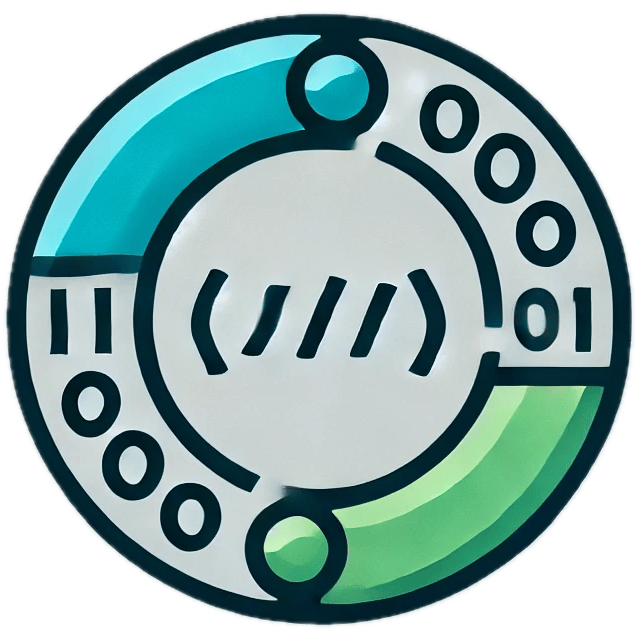

<h1 align="center">
  
   
    <B>P</B>ractice <B>M</B>akes <B>C</B>ode <B>A</B>ccepted
   
</h1>

<h2 align="center">
     Review LeetCode problems based on Ebbinghaus's Forgetting Curve
</h2>

  

🔗<a href="https://chrome.google.com/webstore/detail/pmca/nojegmfgpgdicmogicikihalccihhkid">Get PMCA from Chrome Web Store</a>

 

# Get Started

1. Install the PMCA extension in your web browser. After the installation / If the submission is not tracked, pls try to restart your browser.
2. Solve and submit LeetCode problems. Upon successful submission, PMCA sets the next review time for the problem based on the Ebbinghaus forgetting curve.
3. Open PMCA to view problems that need to be reviewed now, problems scheduled for future review and mastered problems. You can use the switch in the popup page to switch between the LeetCode global site and the LeetCode CN site.
4. Enjoy coding!

# Next Steps

- ✅ ~~support paging~~
- ✅ ~~support new UI version of leetcode~~
- ✅ ~~support features like `mark as mastered`, `reset progress`~~
- 🚫 support auto sync submission to github (won't do)
- ✅ ~~refractor with webpack for scalability~~
- ✅ ~~support sync data across devices~~
- ✅ ~~support tracking submission by `ctrl` + `Enter`(Linux / Windows), "Command" + `Enter` (MacOS) in the "Dynamic Layout"~~
- 🔲 inject a button in the LeetCode nav bar
- 🔲 support customized configuration of review intervals
- 🔲 support importing previous submission records
